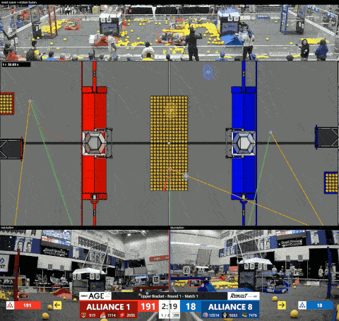

# autoscout

> Built with the assistance of [Claude](https://claude.ai) (Anthropic). The
> design decisions, calibration and labelling are the author's; much of the code
> and analysis was written in collaboration with Claude Code.

Robot tracking for FRC matches from the broadcast video alone: no field
instrumentation, no team-side hardware. One match VOD in, six continuous robot
trajectories in field metres out, with a per-frame uncertainty ellipse for each.

[](https://cdn.hackclub.com/01a0e35b-a60e-7d01-949b-d0e503af08ca/fused_full_demo.mp4)

*Full match with audio: [fused_full_demo.mp4](https://cdn.hackclub.com/01a0e35b-a60e-7d01-949b-d0e503af08ca/fused_full_demo.mp4).*
Broadcast panel with boxes coloured by track; top-down field with 2σ uncertainty
ellipses, fading trails, and a line from each robot to every camera that saw it
(green = carries most of the fused information, orange = least); station views below.

This repository is the **framework**: source, browser tools and documentation.
It ships without video, labels, calibrations, detections or model weights —
those are all specific to one event and one camera setup and are regenerated for
each match by following [INSTRUCTIONS.md](INSTRUCTIONS.md).
Field images and AprilTag layouts come from
[WPILib](https://github.com/wpilibsuite/allwpilib) (see INSTRUCTIONS §0).

## How it works

1. **Calibration** — every broadcast panel (the wide field camera and the two
   driver-station cameras) is solved into one field coordinate frame from
   hand-marked carpet features, straight lines (for lens distortion), AprilTags
   and cross-view correspondences. Browser tools do the marking; the solve runs
   live as you mark.
2. **Detection** — a YOLO detector finds robots in each panel. Only the bottom
   edge of a box is used: it is where the robot meets the carpet.
3. **Geometry** — each detection is back-projected onto the carpet, corrected
   from "nearest bumper corner" to "footprint centre", and given an anisotropic
   uncertainty ellipse from that camera's Jacobian.
4. **Tracklets** — a constant-velocity Kalman filter in field metres, per camera,
   with a hard physical speed gate. Tracklets are short but pure.
5. **Identity** — an exact minimum-cost cover by three time-ordered paths per
   alliance decides which tracklets belong to the same robot. Station-camera
   tracklets are used as *link evidence* across occlusions, never merged.
6. **Smoothing and output** — an RTS smoother per robot over every camera's
   measurements, then a side-by-side render of broadcast, top-down field with
   ellipses and trails, and the station views.

`docs/COMPONENTS.md` records the measured accuracy, reliability and limitations
of each stage on the development match, and the integration hazards found while
building it.

## Layout

```
src/            pipeline modules and drivers (see INSTRUCTIONS.md)
src/experiments one-off analysis scripts kept for reference; not part of the pipeline
*.html          browser tools: label, calib, lines, pair, trace  (served by src/serve.py)
docs/           component reference
data/ out/ runs/   per-match inputs and artefacts — git-ignored, created by you
```

## Requirements

Python 3.11+, the packages in `requirements.txt`, and `ffmpeg` on the path for
muxing audio into renders. Inference and tracking run on a standard Mac; training
was done on a cloud GPU (`src/train_kaggle.py`).
